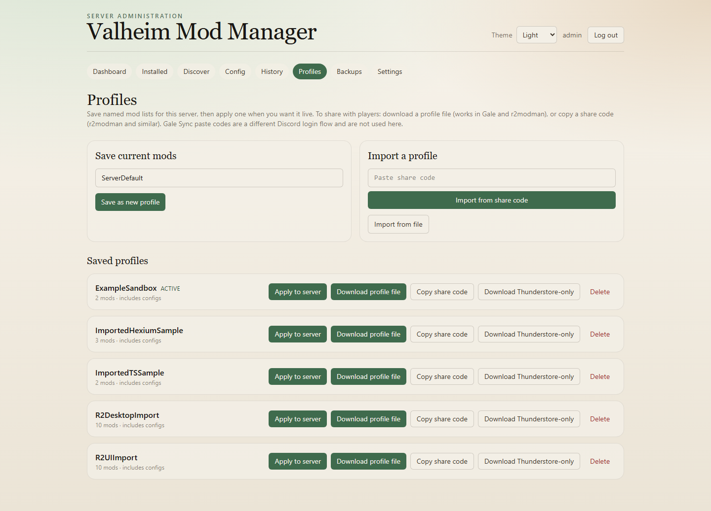

# Valheim Mod Manager

A small web UI that sits next to a [community-valheim-tools/valheim-server](https://github.com/community-valheim-tools/valheim-server-docker) container and manages BepInEx mods (Thunderstore + Hexium). It writes into the shared `config/bepinex` tree and uses Supervisor to stop → bootstrap → start the game. It does not replace the Valheim image or touch world saves.

| | Image |
|---|---|
| Valheim | `ghcr.io/community-valheim-tools/valheim-server` |
| This manager | `ghcr.io/sonicdm/valheim-mod-manager:latest` (or pin e.g. `:0.3.0`) |

Day to day: **Discover → Install → Restart + sync**. Theme (System / Light / Dark) lives in the header; default is System.


## Quick start (new host)

```bash
mkdir -p valheim-stack/config valheim-stack/data && cd valheim-stack
curl -fsSL -o docker-compose.yml \
  https://raw.githubusercontent.com/sonicdm/ValheimModManager/main/docker-compose.combined.example.yml
curl -fsSL -o .env.example \
  https://raw.githubusercontent.com/sonicdm/ValheimModManager/main/.env.example
cp .env.example .env
# Edit .env — at least MOD_MANAGER_SECRET_KEY, MOD_MANAGER_ADMIN_PASSWORD, SERVER_PASS
docker compose pull
docker compose up -d
```

Open http://localhost:8090 and sign in as `admin` with `MOD_MANAGER_ADMIN_PASSWORD`. First boot with `BEPINEX=true` creates `config/bepinex`; the manager mounts that path. No `--build` needed.

| Variable | What it’s for |
|---|---|
| `MOD_MANAGER_SECRET_KEY` | Session signing — use a long random string |
| `MOD_MANAGER_ADMIN_PASSWORD` | UI login for `admin` |
| `SERVER_PASS` | Valheim join password |
| `SUPERVISOR_HTTP_PASS` | Optional; match the manager’s `SUPERVISOR_PASSWORD` if you set one |
| `MOD_MANAGER_PORT` | Host port for the UI (default `8090`) |
| `TIMEZONE` | IANA zone for the maintenance clock (default `America/Los_Angeles`) |

**Already have Valheim running?** Use this repo’s standalone `docker-compose.yml`, point `VALHEIM_BEPINEX_PATH` / `VALHEIM_DOCKER_NETWORK` / `SUPERVISOR_URL` at that server, turn on `SUPERVISOR_HTTP=true` on Valheim, then `docker compose up -d`. `docker-compose.merge.example.yml` is a sibling-service sketch.

**Updating the manager:** `docker compose pull && docker compose up -d`. Pin a version in compose if you don’t want `:latest`.

Don’t bind-mount `data/bepinex` into the manager — the Valheim image renames that tree during BepInEx merge and a bind mount will fight it.

## Using the UI

### Dashboard

Status, counts, pending updates, next maintenance window, recent activity.


| Button | |
|---|---|
| **Scan plugins** | Re-read `config/bepinex` (also runs once when the manager starts) |
| **Check updates** | Refresh store indexes if stale, then compare installed mods |
| **Update all** | Apply pending updates for managed packages |
| **Restart + sync** | Stop `valheim-server` → run `valheim-bootstrap` → start again |

After installs, uninstalls, config saves, or **Make persistent**, hit **Restart + sync**. A banner shows when something is waiting on a restart.

### Discover → install

Search and filter on **Discover** (include/exclude categories, Thunderstore / Hexium / both). Defaults lean server-side so client-only chrome stays out of the way.


Open a package for details, changelog, and an install card (version pick, optional preview). Install unpacks into `config/bepinex/plugins` (and patchers when present). Then restart so the game loads it. Big packs show progress on the package page while they run.


### Installed

Everything already on disk. You can import a zip/DLL, disable without deleting, pin against auto-updates, jump to config, link an unmanaged DLL to a store package, uninstall, or mark bulky mods **persistent** (see below).


### Config

`.cfg` files under `config/bepinex/config`. Structured editor when the file parses cleanly, raw text otherwise. Save, then restart if the mod only reads config at startup.


### History, Backups, Profiles

**History** is the audit log (installs, scans, restarts, settings, errors). **Backups** zip managed plugin state before you do something risky.

**Profiles** are named mod lists for this server: save the current install, import a file or Thunderstore/r2modman share code, apply a profile (full replace of managed packs, backup first), or export `.r2z` / a share code. Gale Sync paste needs Discord login — the share code here is the UUID style, not that.



### Settings

Server name, timezone, Supervisor URL/credentials, Thunderstore/Hexium toggles, update policy and maintenance window, admin password, and theme (same as the header; stored in the browser only).


Timezone from Compose `TIMEZONE` is pushed into Settings on container start.

### Scheduled maintenance

The manager has no idea who is online. Private Valheim servers don’t expose that, and there is no player probe here.

So the maintenance window does **not** auto-install or restart unless you turn on **Allow unattended scheduled maintenance**. Leave that off (the default) and use **Update all** + **Restart + sync** yourself when the box is empty. If you turn it on, scheduled work can kick people who are playing — that’s on you.

## How it talks to Valheim

With `BEPINEX=true`, the game image keeps plugins under `/config/bepinex` and copies them into the live tree during `valheim-bootstrap`. The manager:

1. Writes installs on the **config** mount only
2. Applies them through Supervisor (stop → bootstrap → start)
3. Leaves worlds and the Valheim image alone

Same layout as the old [lloesche/valheim-server-docker](https://github.com/lloesche/valheim-server-docker) Supervisor ABI. Legacy `ghcr.io/lloesche/valheim-server` tags still work while they exist.

Keep the UI on your LAN or behind a login you trust. Don’t hang it on the open internet. It only writes under the mounted BepInEx tree and its own `/data` volume; package zips are treated as untrusted (path traversal / symlink members rejected).

### Persistent packages

For huge trees (web map tiles, asset packs), **Make persistent** moves files to `config/bepinex/.persistent/<package>/` and leaves a symlink in `plugins/`. Bootstrap still syncs from `plugins/`.

On Windows/SMB hosts that symlink on the share is often junk inside Linux, so the live tree drops the pack after sync. The manager can’t fix that from Supervisor alone. Put this on the Valheim service (already in `docker-compose.combined.example.yml`):

```yaml
# Compose: $$ becomes $ inside the container
- POST_BEPINEX_CONFIG_HOOK=for d in /config/bepinex/.persistent/*/; do [ -d "$$d" ] || continue; name=$$(basename "$$d"); ln -sfn "/config/bepinex/.persistent/$$name" "/opt/valheim/bepinex/BepInEx/plugins/$$name"; done
```

Don’t bind-mount onto `data/bepinex/.../plugins/...` either — BepInEx merge renames that tree.

## Combined Compose

See `docker-compose.combined.example.yml` for the full file. Sketch:

```yaml
services:
  valheim:
    image: ghcr.io/community-valheim-tools/valheim-server
    volumes:
      - ./config:/config
      - ./data:/opt/valheim
    ports:
      - "2456-2458:2456-2458/udp"
      - "9001:9001/tcp"   # Supervisor HTTP — LAN only
    environment:
      - BEPINEX=true
      - SUPERVISOR_HTTP=true
      - SUPERVISOR_HTTP_PORT=9001
      - POST_BEPINEX_CONFIG_HOOK=for d in /config/bepinex/.persistent/*/; do [ -d "$$d" ] || continue; name=$$(basename "$$d"); ln -sfn "/config/bepinex/.persistent/$$name" "/opt/valheim/bepinex/BepInEx/plugins/$$name"; done
      # plus SERVER_NAME, WORLD_NAME, SERVER_PASS, TZ, SUPERVISOR_HTTP_* …
    restart: unless-stopped
    stop_grace_period: 2m

  mod-manager:
    image: ghcr.io/sonicdm/valheim-mod-manager:latest
    depends_on: [valheim]
    ports:
      - "${MOD_MANAGER_PORT:-8090}:8090"
    volumes:
      - mod_manager_data:/data
      - ./config/bepinex:/valheim/bepinex
      - ./config/bepinex:/config/bepinex
    environment:
      - DATA_DIR=/data
      - BEPINEX_ROOT=/valheim/bepinex
      - SECRET_KEY=${MOD_MANAGER_SECRET_KEY}
      - ADMIN_PASSWORD=${MOD_MANAGER_ADMIN_PASSWORD:-changeme}
      - SUPERVISOR_URL=http://valheim:9001
      - SUPERVISOR_USER=admin
      - SUPERVISOR_PASSWORD=${SUPERVISOR_HTTP_PASS:-}
      - SUPERVISOR_PROGRAM=valheim-server
      - TIMEZONE=${TIMEZONE:-America/Los_Angeles}
    restart: unless-stopped

volumes:
  mod_manager_data:
```

Wait until first Valheim boot has created `config/bepinex` before expecting the UI to manage mods. Manager state lives in `mod_manager_data`.

## Development

For a live server, prefer pulled images. To hack on the manager, uncomment `build: .` in compose and `docker compose up -d --build`, or run locally:

```bash
# Backend
cd backend
python -m venv .venv
# Windows: .\.venv\Scripts\activate
# Linux/macOS: source .venv/bin/activate
pip install -r requirements.txt
export DATA_DIR=../data-dev
export BEPINEX_ROOT=../example_mods/bepinex
export ADMIN_PASSWORD=changeme
uvicorn app.main:app --reload --port 8090

# Frontend (other terminal)
cd frontend
npm install
npm run dev
```

Use `example_mods/bepinex` and `data-dev/` as a sandbox — don’t point a dev process at a live server tree. Tests: `cd backend && pytest`.

Don’t commit or ship a full working tree (`.venv`, `node_modules`, `data/`). Production is Compose + `.env` + images from GHCR.
