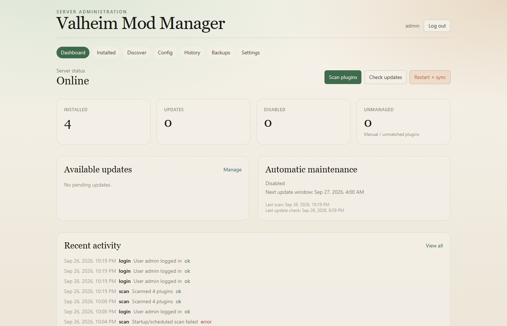
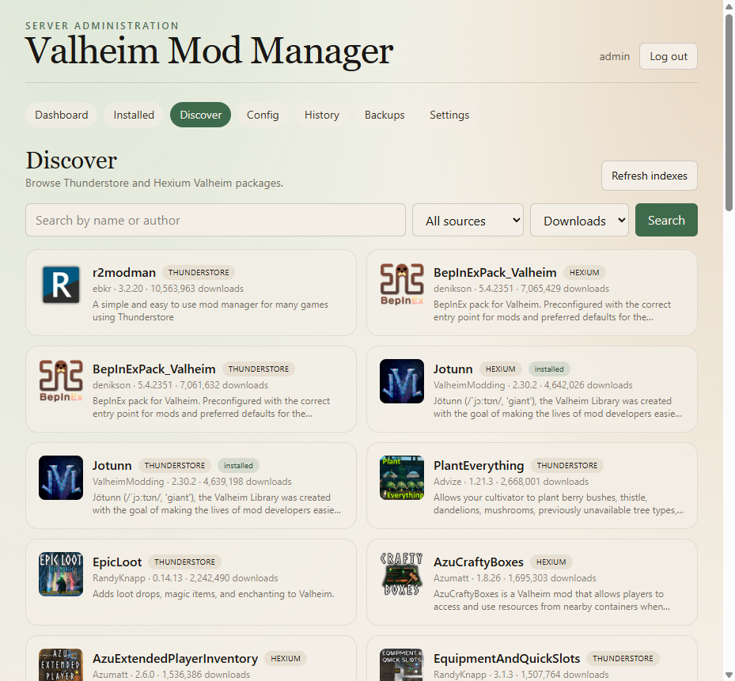
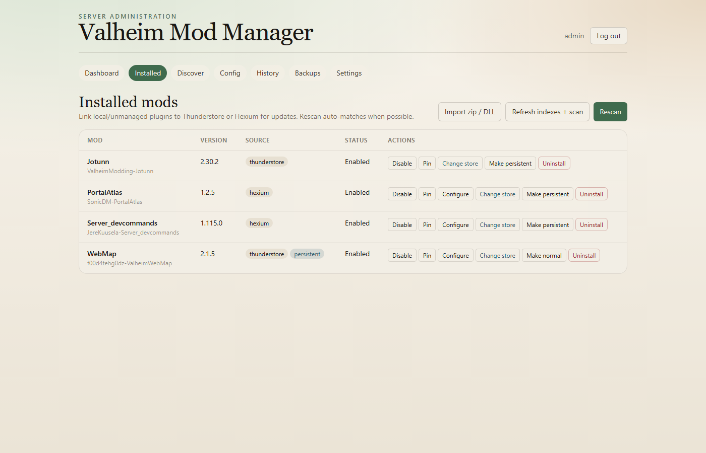
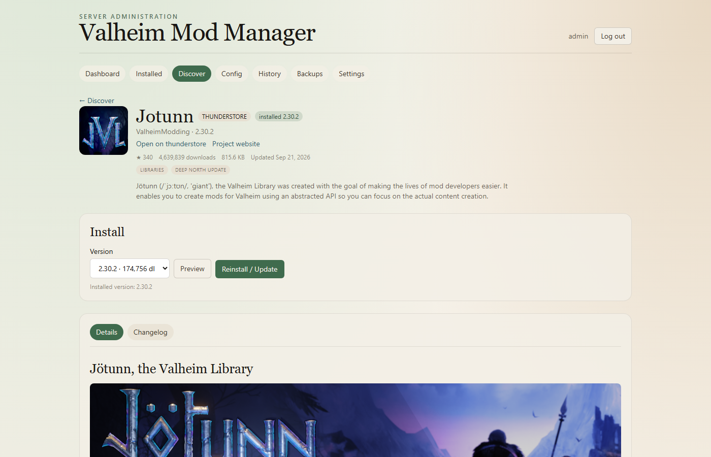
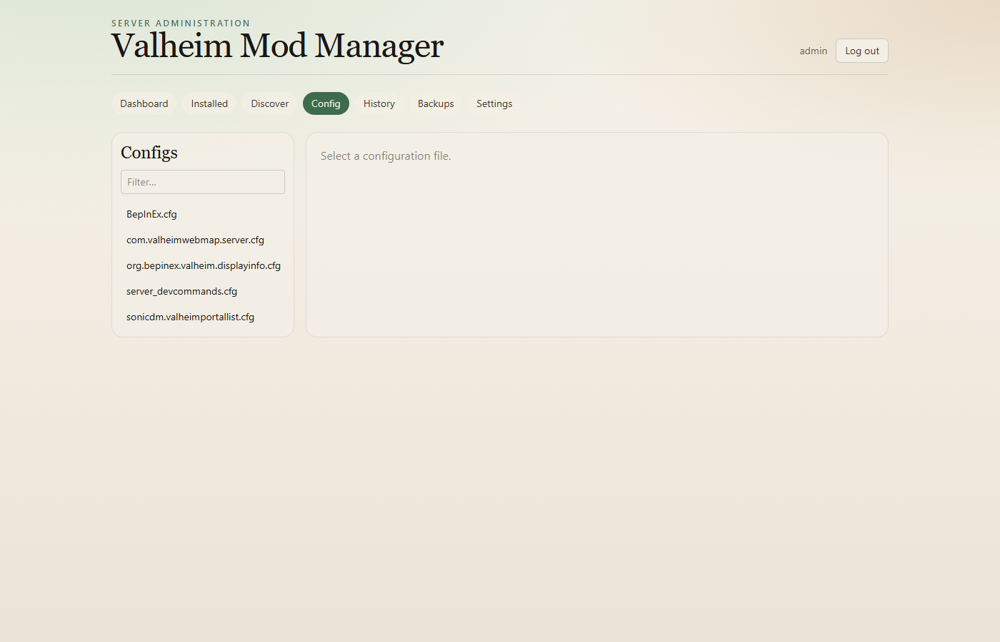
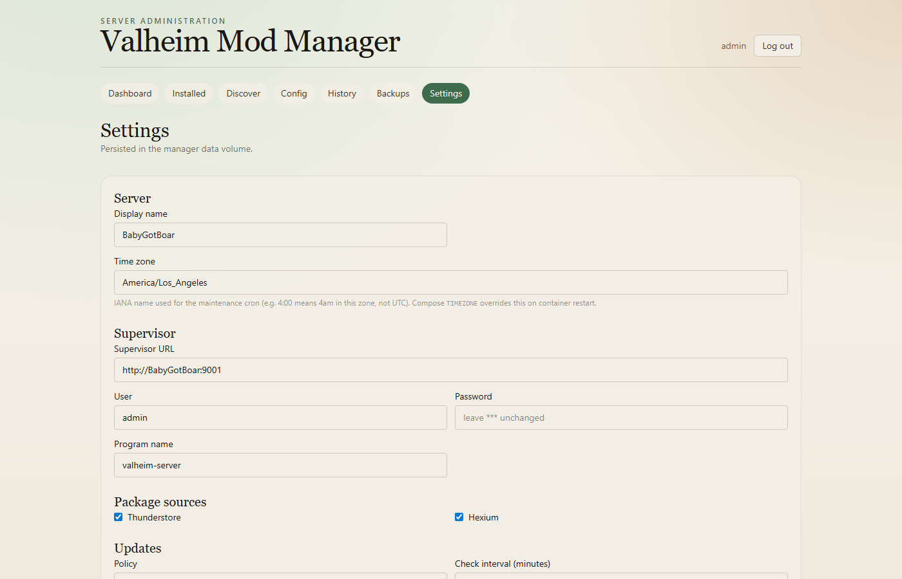
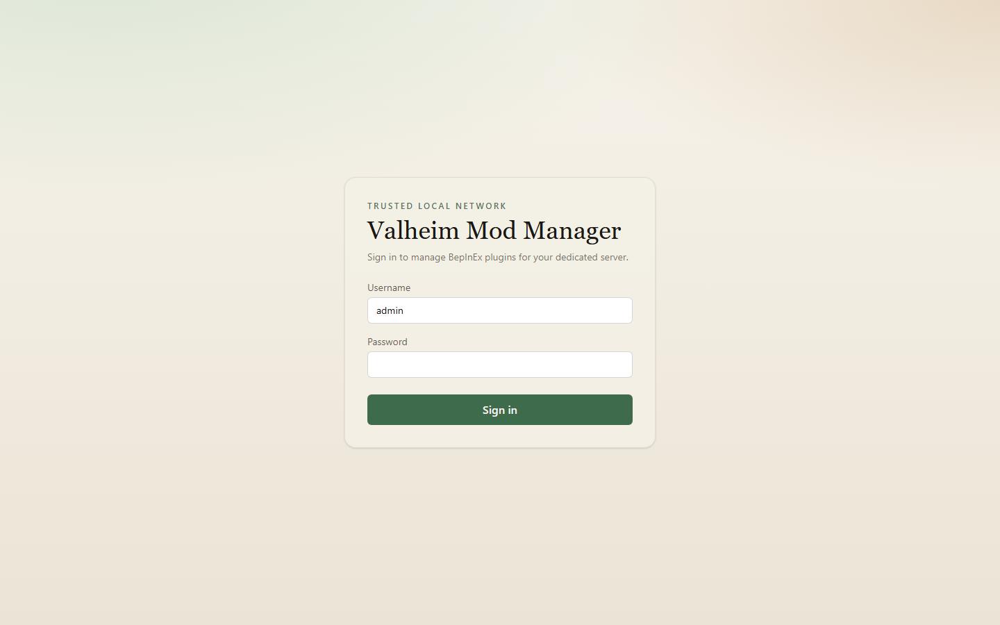

# Valheim Mod Manager

Self-hosted companion for an existing [community-valheim-tools/valheim-server](https://github.com/community-valheim-tools/valheim-server-docker) deployment. Discover, install, configure, update, and roll back BepInEx mods from **Thunderstore** and **Hexium** without replacing the game container or touching world saves.

**Images (preferred — no local build):**

| Role | Image |
|---|---|
| Valheim server | `ghcr.io/community-valheim-tools/valheim-server` |
| Mod manager | `ghcr.io/sonicdm/valheim-mod-manager:latest` (or pin `:0.1.0`) |

The Valheim image is the relocated home of the former [lloesche/valheim-server-docker](https://github.com/lloesche/valheim-server-docker) project (same layout and Supervisor ABI). Legacy `ghcr.io/lloesche/valheim-server` tags remain compatible until they disappear.

## Screenshots



| Discover | Installed |
| --- | --- |
|  |  |

| Package install | Config editor |
| --- | --- |
|  |  |

| Settings | Sign in |
| --- | --- |
|  |  |

## How it fits the Valheim image

With `BEPINEX=true`, the server image keeps a persistent tree under `/config/bepinex` and syncs plugins/patchers into `/opt/valheim/bepinex/BepInEx/` during `valheim-bootstrap` (container start and BepInEx install/update). The manager:

1. Writes installs to the **config** mount (`.../config/bepinex`)
2. Applies changes by stopping `valheim-server`, running `valheim-bootstrap`, then starting `valheim-server` again — it does **not** bind-mount or write `data/bepinex`
3. Leaves the Valheim image and world saves alone

**Persistent packages** (Make persistent) need a Valheim-side hook — see [Persistent packages](#persistent-packages). The manager only talks to Supervisor; it cannot recreate live plugin symlinks itself.

Do **not** copy a full git working tree as-is (`.venv`, `node_modules`, and `data/` are machine-local). For production you only need Compose files + `.env` and pulled images.

## Quick start (pull images)

Use published GHCR images. You do **not** need `--build`.

### Combined (Valheim + manager)

Best path for a new host. Grab the example compose and env template, create `config/` / `data/`, then pull and start:

```bash
mkdir -p valheim-stack/config valheim-stack/data && cd valheim-stack
curl -fsSL -o docker-compose.yml \
  https://raw.githubusercontent.com/sonicdm/ValheimModManager/main/docker-compose.combined.example.yml
curl -fsSL -o .env.example \
  https://raw.githubusercontent.com/sonicdm/ValheimModManager/main/.env.example
cp .env.example .env
# set MOD_MANAGER_SECRET_KEY, MOD_MANAGER_ADMIN_PASSWORD, SERVER_PASS, …
docker compose pull
docker compose up -d
```

Open http://localhost:8090 and sign in as `admin` with `MOD_MANAGER_ADMIN_PASSWORD`. After the first boot with `BEPINEX=true`, BepInEx creates `config/bepinex` (the manager mounts that path).

| Variable | Typical value |
|---|---|
| `MOD_MANAGER_SECRET_KEY` | Long random string (session/CSRF signing) |
| `MOD_MANAGER_ADMIN_PASSWORD` | UI login password for user `admin` |
| `SERVER_PASS` | Valheim join password |
| `SUPERVISOR_HTTP_PASS` | Optional; same value as manager `SUPERVISOR_PASSWORD` if set |
| `MOD_MANAGER_PORT` | Host port for the UI (default `8090`) |
| `TIMEZONE` | IANA zone for maintenance cron (default `America/Los_Angeles`) |

Do **not** bind-mount `data/bepinex` or its `plugins`/`patchers` into the manager. Those binds pin the directory the Valheim image renames during BepInEx merge.

### Standalone manager (existing Valheim container)

If Valheim already runs elsewhere, clone or copy this repo’s `docker-compose.yml` + `.env.example`, point `VALHEIM_BEPINEX_PATH` / `VALHEIM_DOCKER_NETWORK` / `SUPERVISOR_URL` at that server, enable `SUPERVISOR_HTTP=true` on Valheim, then:

```bash
docker compose pull
docker compose up -d
```

See `docker-compose.merge.example.yml` for a sibling-service sketch.

### Updating

Merges to `main` and tags `v*` publish new images. On the host:

```bash
docker compose pull
docker compose up -d
```

Pin with `image: ghcr.io/sonicdm/valheim-mod-manager:0.1.0` instead of `:latest` if you want a fixed release.

## Usage

After login you get seven pages. Day-to-day work is mostly **Discover → Installed → Restart + sync**.

### Dashboard

- **Scan plugins** — Walks `config/bepinex` and updates the managed list. Prunes packages that disappeared from disk. Also runs once automatically when the manager process starts; use the button after you change files outside the UI.
- **Check updates** — Compares installed managed mods against Thunderstore/Hexium indexes and shows pending updates.
- **Restart + sync** — Stops `valheim-server`, runs `valheim-bootstrap` (copies plugins/patchers into the live BepInEx tree), then starts the server again. Use this after installs, uninstalls, config changes that need a reload, or **Make persistent**.

Also shows server status, counts, pending updates, maintenance schedule (local wall-clock), and recent activity.

### Discover and install

1. Open **Discover**. Search by name/author; use **Include categories** / **Exclude categories** (Thunderstore-style), source, and sort. Defaults to server-side tags (`Server-side`, Hexium `Server-only` / `Client & Server`) so client-only chrome stays out of the way.
2. Open a package. The page loads the store **README** / **Changelog** (full markdown, not just the short blurb), categories, and stats. Pick a version, optionally **Preview**, then **Install**.
3. Install downloads the zip, extracts into staging, copies into `config/bepinex/plugins` (and patchers when present), and records the package in the manager DB.
4. When the install finishes, use **Restart + sync** on the dashboard so the game process actually loads the new files.

Large packs can take a while; the install page shows progress while the request runs.

### Installed

Manage everything already on disk:

| Action | What it does |
|---|---|
| **Disable / Enable** | Moves the plugin folder aside or back without deleting it |
| **Pin / Unpin** | Blocks automatic updates for that package |
| **Configure** | Jumps to that mod’s `.cfg` in **Config** (when one is known) |
| **Link store / Change store** | Attach a local/unmanaged DLL to a Thunderstore or Hexium package for updates |
| **Make persistent** | For bulky mods (lots of small files). Moves files to `config/bepinex/.persistent/<package>` and leaves a symlink in `plugins/` pointing at `/config/bepinex/.persistent/<package>`. Requires `POST_BEPINEX_CONFIG_HOOK` on the Valheim service — see [Persistent packages](#persistent-packages). |
| **Make normal** | Undoes persistent layout (files back under `plugins/`) |
| **Uninstall** | Removes managed files and the DB row |
| **Import zip / DLL** | Drop a local package when it isn’t on a store |
| **Rescan** / **Refresh indexes + scan** | Re-read disk and/or refresh package indexes |

A **persistent** badge appears on rows that use the symlink layout.

### Persistent packages

Use **Make persistent** for mods with huge on-disk trees (WebMap tiles, asset packs, etc.). Layout:

| Path | Role |
|---|---|
| `config/bepinex/.persistent/<package>/` | Real files (DLL + runtime data) |
| `config/bepinex/plugins/<package>` | Symlink → `/config/bepinex/.persistent/<package>` |

Bootstrap still syncs `plugins/` into `/opt/valheim/bepinex/BepInEx/plugins/`. On many hosts (especially **Windows/SMB** volumes) that config-side symlink is not a valid Linux link inside the Valheim container, so sync treats the package as missing and removes it from the live tree. Restart + sync cannot fix that: the manager only has Supervisor (`stop` / `valheim-bootstrap` / `start`), not a shell in the game container.

**Required on the Valheim service** — recreate a Linux symlink for every `.persistent` package after each BepInEx config/sync:

```yaml
# Compose: $$ becomes $ inside the container
- POST_BEPINEX_CONFIG_HOOK=for d in /config/bepinex/.persistent/*/; do [ -d "$$d" ] || continue; name=$$(basename "$$d"); ln -sfn "/config/bepinex/.persistent/$$name" "/opt/valheim/bepinex/BepInEx/plugins/$$name"; done
```

This is included in `docker-compose.combined.example.yml`. If Valheim already runs in another compose file, add the same env var there (see `docker-compose.merge.example.yml`). Do **not** bind-mount onto `data/bepinex/.../plugins/...` — BepInEx merge renames that tree.

### Config

Lists BepInEx and mod `.cfg` files under the config tree. Open one to edit (structured fields when parseable, raw text otherwise). Save, then **Restart + sync** if the mod only reads config at startup.

### History and Backups

- **History** — Audit log of installs, uninstalls, scans, restarts, settings changes, and errors.
- **Backups** — Create or restore zip backups of managed plugin state before risky upgrades.

### Settings

- Set **time zone** (IANA name, e.g. `America/Los_Angeles`) so the maintenance cron runs at local wall-clock time — not UTC. Compose `TIMEZONE` overrides this on every container start.
- Enable **automatic maintenance** (update check + optional apply in a time window).
- Choose whether maintenance restarts the server after updates.
- **Force restart when player status is unknown** — off by default (fail-safe); turn on only if you accept restarts when the manager cannot prove the server is empty.
- Change the admin password.

### Typical flow (new mod)

1. **Discover** → install the package.
2. If it is huge (web map tiles, asset packs, etc.), **Installed** → **Make persistent** (ensure `POST_BEPINEX_CONFIG_HOOK` is set — [Persistent packages](#persistent-packages)).
3. Dashboard → **Restart + sync**.
4. Edit `.cfg` under **Config** if needed, then restart again.

## Combined Compose reference

Full YAML for the combined stack (same as `docker-compose.combined.example.yml`). Both services use published images — Valheim from CVT, manager from `ghcr.io/sonicdm/valheim-mod-manager`.

```yaml
services:
  valheim:
    image: ghcr.io/community-valheim-tools/valheim-server
    container_name: valheim
    cap_add:
      - sys_nice
    volumes:
      - ./config:/config
      - ./data:/opt/valheim
    ports:
      - "2456-2458:2456-2458/udp"
      - "9001:9001/tcp"   # Supervisor HTTP (LAN only)
    environment:
      - SERVER_NAME=${SERVER_NAME:-My Server}
      - WORLD_NAME=${WORLD_NAME:-Dedicated}
      - SERVER_PASS=${SERVER_PASS:-secret}
      - SERVER_PUBLIC=${SERVER_PUBLIC:-0}
      - TZ=${TIMEZONE:-America/Los_Angeles}
      - BEPINEX=true
      - SUPERVISOR_HTTP=true
      - SUPERVISOR_HTTP_PORT=9001
      - SUPERVISOR_HTTP_USER=admin
      - SUPERVISOR_HTTP_PASS=${SUPERVISOR_HTTP_PASS:-}
      # Relink .persistent packages after bootstrap (see Persistent packages)
      - POST_BEPINEX_CONFIG_HOOK=for d in /config/bepinex/.persistent/*/; do [ -d "$$d" ] || continue; name=$$(basename "$$d"); ln -sfn "/config/bepinex/.persistent/$$name" "/opt/valheim/bepinex/BepInEx/plugins/$$name"; done
    restart: unless-stopped
    stop_grace_period: 2m

  mod-manager:
    image: ghcr.io/sonicdm/valheim-mod-manager:latest
    container_name: ValheimModManager
    depends_on:
      - valheim
    ports:
      - "${MOD_MANAGER_PORT:-8090}:8090"
    volumes:
      - mod_manager_data:/data
      - ./config/bepinex:/valheim/bepinex
      - ./config/bepinex:/config/bepinex
    environment:
      - DATA_DIR=/data
      - BEPINEX_ROOT=/valheim/bepinex
      - SECRET_KEY=${MOD_MANAGER_SECRET_KEY}
      - ADMIN_PASSWORD=${MOD_MANAGER_ADMIN_PASSWORD:-changeme}
      - SUPERVISOR_URL=http://valheim:9001
      - SUPERVISOR_USER=admin
      - SUPERVISOR_PASSWORD=${SUPERVISOR_HTTP_PASS:-}
      - SUPERVISOR_PROGRAM=valheim-server
      - CONTAINER_DISPLAY_NAME=valheim
      - TIMEZONE=${TIMEZONE:-America/Los_Angeles}
    restart: unless-stopped

volumes:
  mod_manager_data:
```

Open http://localhost:8090 after BepInEx has created `config/bepinex` (first boot with `BEPINEX=true`). Do **not** bind-mount `data/bepinex`.

On launch the manager runs a **one-shot plugin scan** (and refreshes package indexes) in the background. Persistent manager state lives in the `mod_manager_data` volume.

If Valheim already runs in another compose project, use the standalone `docker-compose.yml` plus an external network — see [Quick start](#standalone-manager-existing-valheim-container).

## Development

Prefer pulled images for running a server. To hack on the manager, uncomment `build: .` next to the `image:` line in compose and run `docker compose up -d --build`, or run the API/UI locally:

```bash
# Backend
cd backend
python -m venv .venv
# Windows: .\.venv\Scripts\activate
# Linux/macOS: source .venv/bin/activate
pip install -r requirements.txt
export DATA_DIR=../data
export BEPINEX_ROOT=/path/to/valheim-server/config/bepinex
export ADMIN_PASSWORD=changeme
uvicorn app.main:app --reload --port 8090

# Frontend (separate terminal)
cd frontend
npm install
npm run dev
```

Tests:

```bash
cd backend
pytest
```

## Safety notes

- Writes only under the mounted BepInEx tree and the manager `/data` volume.
- Package zips are treated as untrusted; path traversal and symlink members are rejected.
- Automatic maintenance **defers** restarts when player status cannot be proven, unless `force_restart_when_players_unknown` is enabled.
- Intended for a trusted LAN or behind an authenticated reverse proxy — not direct internet exposure.
